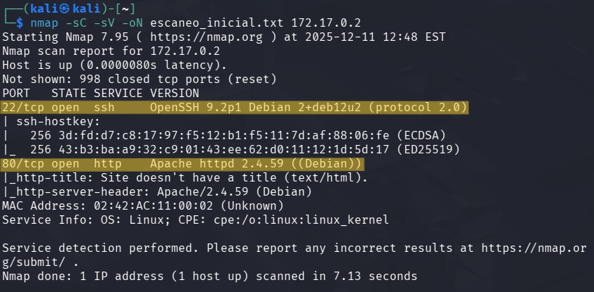
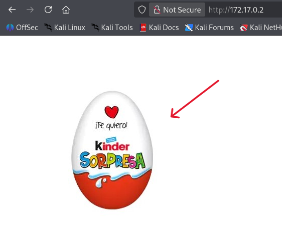
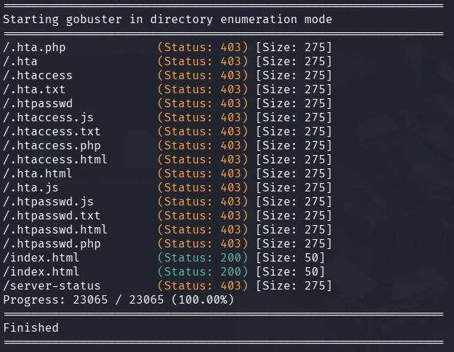
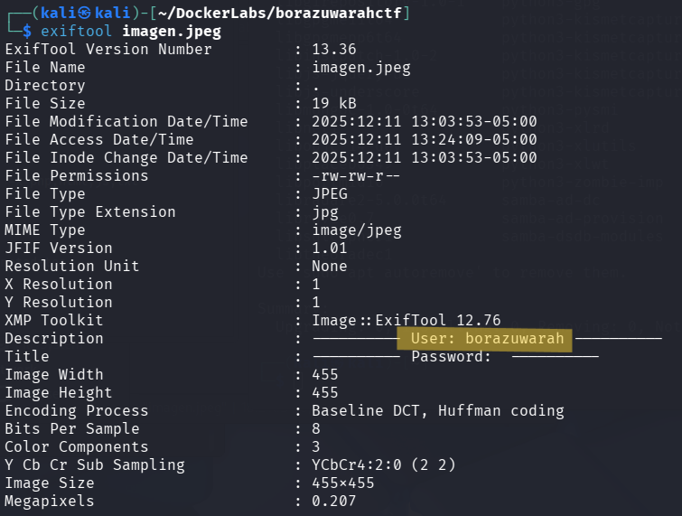
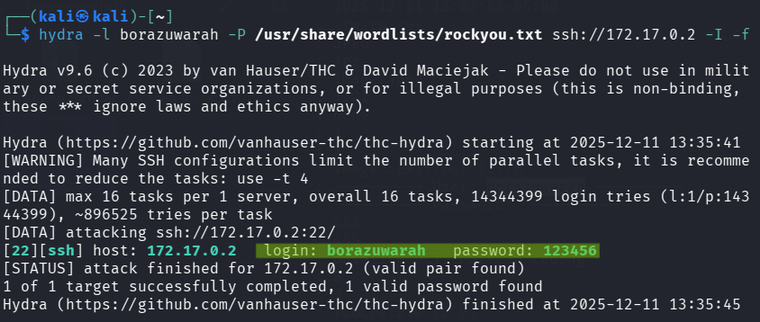
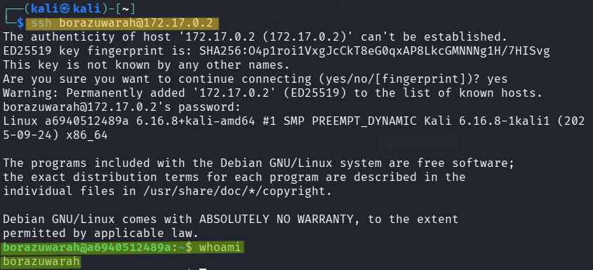
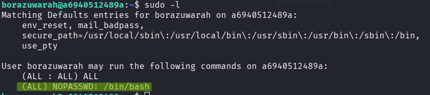
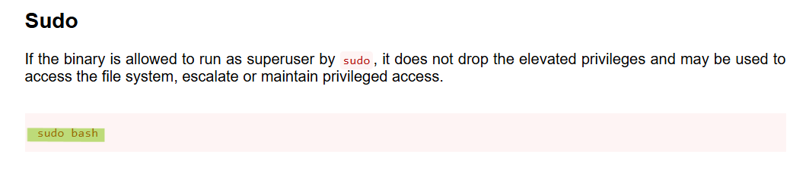
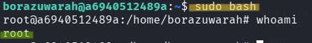

# 🧾 Writeup – Máquina: BorazuwarahCTF

> 🔒 *Este writeup documenta el proceso educativo de explotación de la máquina “BorazuwarahCTF”, orientado únicamente al aprendizaje en ciberseguridad y hacking ético.*

---

## 1. Información General

- **Nombre:** BorazuwarahCTF  
- **Dificultad:** Muy Fácil  
- **Dirección IP:** `172.17.0.2`  
- **Objetivo:** Enumerar los servicios expuestos, identificar una vía de acceso inicial y escalar privilegios hasta comprometer completamente la máquina.

El enfoque de la máquina es la obtención de credenciales a partir de información oculta y la escalada de privilegios por mala configuración de sudo, permitiendo acceso root sin contraseña.

---

## 2. Reconocimiento Inicial `nmap`

Se realizó un escaneo de puertos y servicios utilizando **nmap**, con scripts por defecto y detección de versiones:

```bash
nmap -sC -sV -oN escaneo_inicial.txt 172.17.0.2
```



### 🔎 Resultados del escaneo

> - 22/tcp open - ssh - OpenSSH 9.2p1 Debian 2+deb12u2 (protocol 2.0)
> - 80/tcp open - http - Apache httpd 2.4.59 (Debian)

- **Puerto 22 (SSH):** Servicio SSH activo con una versión relativamente reciente. Sin credenciales, no es explotable de forma directa, por lo que será necesario obtener un usuario válido o credenciales mediante enumeración u otra vía.
- **Puerto 80 (HTTP):** Servidor Apache activo, lo que indica una superficie de ataque web. Este servicio suele ser el punto inicial para:
    - Enumeración de rutas y archivos ocultos
    - Descubrimiento de usuarios
    - Obtención de credenciales o información sensible

Dado este escenario, el siguiente paso lógico es explorar el servicio web para identificar contenido útil que permita avanzar en la explotación.

---

## 3. Exploración del Servicio Web (Puerto 80)

Tras identificar el servicio HTTP activo, se accedió directamente a la dirección: `http://172.17.0.2/`



### 🔎 Contenido observado

La página web muestra únicamente una imagen de un huevo Kinder Sorpresa, sin texto adicional, formularios, enlaces visibles ni código HTML relevante a simple vista.

### 📌 Análisis

- No se observa funcionalidad web directa que permita explotación inmediata.
- La imagen del *Kinder Sorpresa* puede interpretarse como una pista simbólica, sugiriendo que:
    - Existe contenido oculto.
    - Hay “algo más” que no es visible a primera vista.
- Este tipo de páginas minimalistas en CTF suelen indicar la necesidad de:
    - Enumeración de directorios y archivos ocultos.
    - Revisión de código fuente.
    - Búsqueda de rutas alternativas o recursos no indexados.

Dado que no hay información útil visible en la página principal, el siguiente paso lógico es realizar **enumeración de rutas y archivos** en el servidor web.

---

## 4. Enumeración de Directorios con `gobuster`

Dado que la página principal no mostraba contenido útil, se procedió a realizar una enumeración de rutas y archivos ocultos en el servidor web utilizando Gobuster:

```bash
gobuster dir -u http://172.17.0.2 -w /usr/share/wordlists/dirb/common.txt -x php,html,js,txt
```



### 🔎 Resultados obtenidos

No se identificaron:

- Archivos sensibles accesibles
- Directorios ocultos funcionales
- Aplicaciones web adicionales
- Rutas con contenido explotable

### 📌 Análisis

- La enumeración no reveló nuevas superficies de ataque web.
- El uso de respuestas 403 indica que los archivos existen, pero están correctamente protegidos por el servidor.
- La ausencia de rutas interesantes refuerza la idea de que la vía web no es el vector principal de explotación, o bien que requiere otro tipo de análisis (metadatos, esteganografía, lógica externa, etc.).

Con la vía web aparentemente agotada, el siguiente paso lógico es replantear la estrategia, evaluando:

- Posibles pistas indirectas (imagen, nombre de la máquina)
- Enumeración o ataques dirigidos al servicio SSH
- Análisis fuera de la enumeración web tradicional

---

## 5. Análisis de la Imagen y Extracción de Metadatos

Dado que la página web mostraba únicamente una imagen (huevo *Kinder Sorpresa*) y no se encontraron rutas ocultas mediante enumeración, se decidió analizar el archivo en busca de información oculta.

La imagen fue descargada localmente para su análisis.

### 🔍 Análisis de metadatos con `ExifTool`

Para inspeccionar posibles metadatos embebidos en la imagen, se utilizó ExifTool.

```bash
# Instalación de la herramienta:
sudo apt install exiftool

# Ejecución del análisis:
exiftool imagen.jpeg
```



### 📌 Análisis

- La imagen contiene metadatos manualmente modificados, lo que indica una pista intencional.
- Se revela explícitamente un nombre de usuario válido: `borazuwarah`
- El campo Password aparece vacío, lo que sugiere que:
    - La contraseña no está incluida directamente.
    - El objetivo es usar este usuario como punto de partida para otro vector (por ejemplo, SSH).

Este hallazgo confirma que la imagen no era decorativa, sino que actuaba como un contenedor de información oculta, alineado con el concepto del *Kinder Sorpresa*.

---

## 6. Ataque de Fuerza Bruta al Servicio SSH `hydra`

Una vez identificado un usuario válido (`borazuwarah`) a partir de los metadatos de la imagen y sabiendo que el servicio SSH está expuesto en el puerto 22, se procedió a realizar un ataque de fuerza bruta dirigido.

```bash
hydra -l borazuwarah -P /usr/share/wordlists/rockyou.txt ssh://172.17.0.2 -I -f
```

> 1. `-l borazuwarah` → Usuario obtenido previamente desde los metadatos de la imagen
>
> 2. `-P rockyou.txt` → Diccionario de contraseñas
>
> 3. `ssh://172.17.0.2` → Servicio objetivo (SSH)
>
> 4. `-I` → Ignora sesiones previas
>
> 5. `-f` → Detiene el ataque al encontrar la primera contraseña válida



### 🔓 Resultado del ataque

Hydra logró encontrar credenciales válidas:

- Usuario: `borazuwarah`
- Contraseña: `123456`

### 📌 Análisis

- La contraseña encontrada es extremadamente débil, una de las más comunes a nivel mundial.
- Esto confirma una mala política de contraseñas en el sistema.
- Al contar ahora con credenciales válidas, es posible acceder directamente al sistema mediante SSH.

---

## 7. Acceso al Sistema y Escalada de Privilegios

### 7.1 Acceso al sistema mediante SSH

Con las credenciales obtenidas previamente, se inició sesión en el sistema a través del servicio SSH:

```bash
ssh borazuwarah@172.17.0.2
```



Esto confirma el acceso exitoso al sistema como usuario sin privilegios administrativos.

### 7.2 Enumeración de privilegios con `sudo -l`

El siguiente paso fue comprobar si el usuario contaba con permisos especiales mediante *sudo*:

```bash
sudo -l
```



### 📌 Análisis

- El usuario borazuwarah puede ejecutar `/bin/bash` como **cualquier usuario**, incluido **root, sin necesidad de contraseña**.
- Esto representa una **configuración crítica e insegura** de sudo.
- Ejecutar un intérprete de comandos (bash) como root implica acceso total al sistema.



Para confirmar el método correcto de explotación, se consultó **GTFOBins**, donde se indica que `sudo bash` permite obtener una shell privilegiada directamente.

### 7.3 Escalada a usuario root

Se ejecutó el siguiente comando:

```bash
sudo bash
```



Con esto, se obtuvo acceso completo al sistema como usuario **root**.