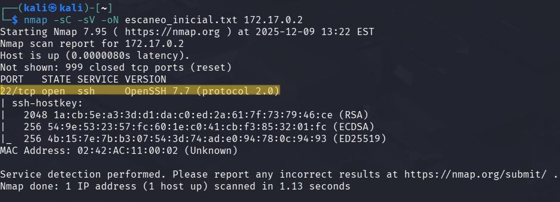
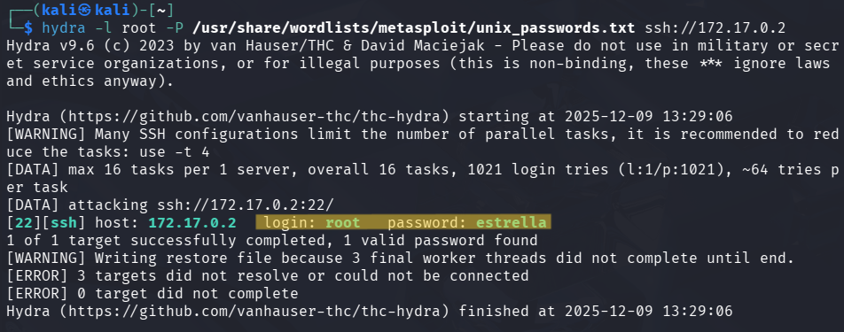
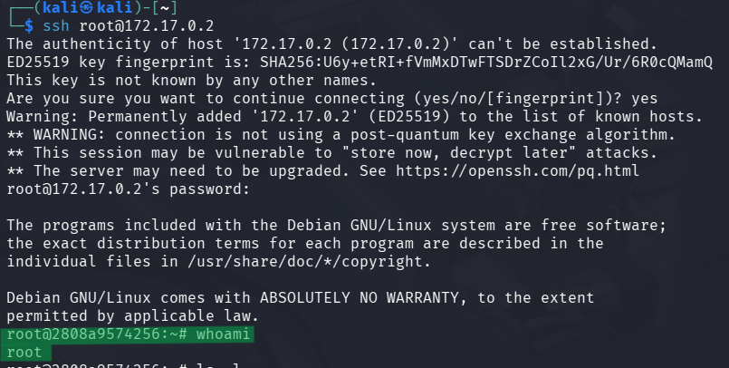

# 🧾 Writeup – Máquina: BreakMySSH

> 🔒 *Este writeup documenta el proceso educativo de explotación de la máquina “BreakMySSH”, orientado únicamente al aprendizaje en ciberseguridad y hacking ético.*

---

## 1. Información General

- **Nombre:** BreakMySSH
- **Dificultad:** Muy Fácil  
- **Dirección IP:** `172.17.0.2`  
- **Objetivo:** Encontrar la debilidad de la máquina, acceder al sistema y obtener privilegios elevados.

La máquina BreakMySSH se centra en el análisis y explotación del servicio SSH y de esa manera obtener acceso al usuario root.

---

## 2. Reconocimiento Inicial

Para identificar los puertos y servicios expuestos, ejecuté un escaneo con nmap utilizando scripts por defecto (-sC) y detección de versiones (-sV):

```bash
nmap -sC -sV -oN escaneo_inicial.txt 172.17.0.2
```



### 🔎 Hallazgos del escaneo

- 22/tcp open ssh – OpenSSH 7.7 (protocol 2.0)
- No existen otros servicios expuestos.

### 🔐 Importante: Vulnerabilidad de enumeración de usuarios en OpenSSH ≤ 7.7

Durante esta etapa también se identificó que la versión **OpenSSH 7.7** es susceptible a una vulnerabilidad conocida de **User Enumeration**.

### ¿En qué consiste?

Las versiones de OpenSSH hasta la 7.7 presentan un comportamiento distinto cuando se ingresa:

- Un usuario válido, pero contraseña incorrecta
- Un usuario inexistente

El tiempo de respuesta del servidor cambia debido a que:

- Para usuarios válidos, el servidor procesa completamente el paquete antes de responder.
- Para usuarios inválidos, OpenSSH responde inmediatamente sin hacer ese procesamiento.

Esta diferencia permite que un atacante determine qué nombres de usuario sí existen en el sistema, simplemente midiendo el tiempo de respuesta o analizando los mensajes devueltos por el servicio SSH.

### ¿Por qué es crítico?

En máquinas donde SSH es el único servicio expuesto, obtener un nombre de usuario válido es prácticamente la mitad del camino, ya que permite:
- Ataques de fuerza bruta dirigidos
- Password spraying
- Intentos con contraseñas por defecto
- Pruebas de acceso con claves privadas filtradas

### ¿Que vamos hacer?

Cómo nuestro objetivo es lograr ingresar con el usuario **root** realizáremos un ataque de fuerza bruta con la finalidad de encontrar la contraseña del usuario **root**

---

## 3. Ataque de Fuerza Bruta con `Hydra`

Dado que la máquina solo expone el servicio SSH y que OpenSSH 7.7 permite enumeración implícita de usuarios, una estrategia viable fue probar directamente si el usuario root tenía una contraseña débil. Para ello, se utilizó **Hydra**

```bash
hydra -l root -P /usr/share/wordlists/metasploit/unix_passwords.txt ssh://172.17.0.2
```



### Resultado del ataque:

Hydra logró encontrar credenciales válidas para el usuario root
- Usuario: `root`
- Contraseña: `estrella`

>- La contraseña pertenece a un diccionario muy común, lo que confirma que el servidor depende de credenciales inseguras.
>- A diferencia de otras máquinas donde primero se debe comprometer un usuario intermedio, aquí se obtiene **acceso privilegiado inmediatamente**.

---

## 4. Acceso al Sistema como Root

Una vez obtenidas las credenciales válidas ( login: `root` -- password: `estrella` ), se procedió a iniciar sesión directamente en el servicio SSH:

```bash
ssh root@172.17.0.2
```

El inicio de sesión fue exitoso y se confirmó el nivel de privilegios con el comando `whoami`



---

## Conclusión

No fue necesaria ninguna escalada de privilegios: el ataque de fuerza bruta proporcionó acceso inmediato al usuario más privilegiado del sistema. La máquina BreakMySSH se basa completamente en la explotación del servicio SSH mal configurado.