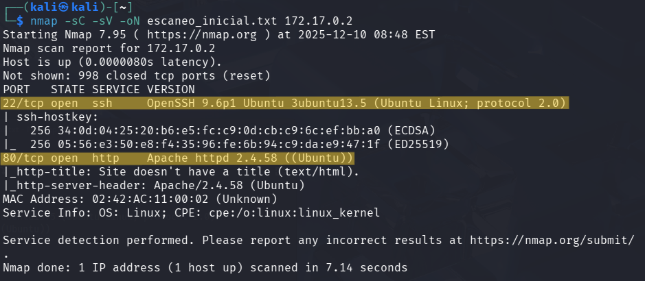
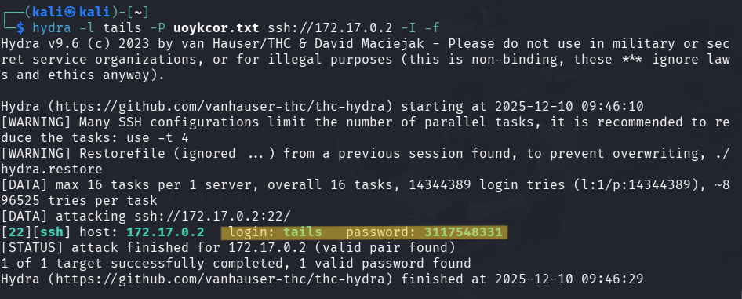
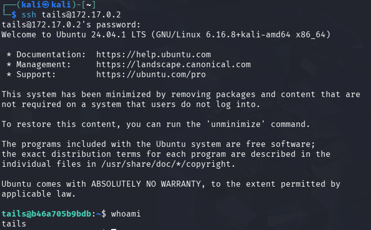
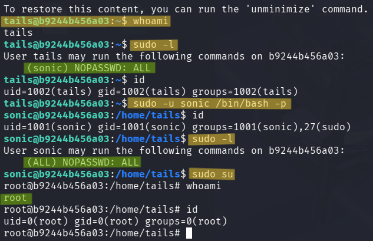

# 🧾 Writeup – Máquina: HedgeHog

> 🔒 *Este writeup documenta el proceso educativo de explotación de la máquina “HedgeHog”, orientado únicamente al aprendizaje en ciberseguridad y hacking ético.*

---

## 1. Información General

- **Nombre:** HedgeHog  
- **Dificultad:** Muy Fácil  
- **Dirección IP:** `172.17.0.2`  
- **Objetivo:** Acceder al sistema identificando un usuario a través del servicio web, obtener sus credenciales mediante fuerza bruta en SSH y finalmente escalar privilegios hasta root.

La máquina se basa en enumeración web mínima, ataque de fuerza bruta dirigido y escalada de privilegios mediante configuraciones inseguras de sudo.

---

## 2. Reconocimiento Inicial `nmap`

Para iniciar la fase de enumeración utilicé el siguiente comando **nmap**:

```bash
nmap -sC -sV -oN escaneo_inicial.txt 172.17.0.2
```

> 1. `sC` → Ejecuta los Nmap Scripting Engine default scripts. 
>       - Incluye scripts seguros que detectan configuraciones débiles, versión de servicios, información del servidor, etc.
>
> 2. `sV` → Activa la detección de versiones de los servicios descubiertos.
>       - Permite identificar exactamente qué software está corriendo.
>
> 3. `oN escaneo_inicial.txt` → Guarda el resultado en un archivo en formato legible.



### 📌 Interpretación del escaneo

- El servidor SSH está habilitado, pero sin credenciales aún no es explotable.
- El puerto 80 tiene un servidor Apache funcionando, lo que sugiere que la máquina probablemente sea explotable mediante enumeración web, archivos expuestos o una mala configuración del servicio HTTP.

---

## 3. Exploración del Servicio Web **(Puerto 80)**

Una vez identificado que el puerto 80/tcp estaba abierto y ejecutando Apache 2.4.58, accedí a la URL: http://172.17.0.2

El sitio mostró únicamente una página muy simple:


### 🔎 Observaciones

Este tipo de páginas minimalistas en máquinas de práctica suelen funcionar como pistas directas.
En este caso, el término `“tails”` es relevante por varios motivos:

- Podría representar el nombre de un usuario del sistema.
- Podría ser el nombre de un directorio accesible en el servidor web (/tails, /tails.php, etc.).
- Al no haber más contenido en el HTML ni elementos ocultos, es razonable asumir que la pista está relacionada a un nombre de usuario real que podremos utilizar más adelante.

---

## 4. Ataque de Fuerza Bruta con `hydra` (SSH)

Considerando que el contenido “tails” probablemente corresponde al nombre de un usuario del sistema, se procedió a probar directamente la autenticación SSH utilizando ese nombre.

El ataque se ejecutó con el siguiente comando `hydra`:

```bash
hydra -l tails -P uoykcor.txt ssh://172.17.0.2 -I -f
```

> 1. `-l tails` → Especifica el nombre de usuario (tails) descubierto en la página web.
>
> 2. `-P uoykcor.txt` → Wordlist de contraseñas utilizada para realizar las pruebas.
>
> 3. `ssh://172.17.0.2` → Objetivo del ataque, servicio SSH en la IP de la máquina.
>
> 4. `-I` → Ignora archivos de restauración previos y fuerza un inicio limpio del ataque.
>
> 5. `-f` → Detiene el ataque cuando se encuentre la primera contraseña válida.



### 🔎 Resultado del ataque

Hydra logró encontrar credenciales válidas para el usuario tails:

- Usuario: `tails`
- Contraseña: `3117548331`

Esto confirma que el usuario existe en el sistema, y que las credenciales son correctas.

---

## 5. Acceso al Sistema mediante SSH

Con las credenciales obtenidas durante el ataque de fuerza bruta `(tails : 3117548331)`, iniciamos sesión por SSH:

```bash
ssh tails@172.17.0.2
```



Una vez dentro, confirmamos el usuario actual con: `whoami`

---

## 6. Escalada de Privilegios

### 6.1. El siguiente paso fue comprobar si el usuario tails tenía permisos sudo configurados de forma insegura:

```bash
sudo -l
```

El sistema respondió:

```bash
(sonic) NOPASSWD: ALL
```

### 🔎 Interpretación

- El usuario tails puede ejecutar cualquier comando como el usuario sonic, sin necesidad de contraseña.
- Esto permite una escalada inicial hacia otro usuario del sistema.

### 6.2. Para cambiar al usuario sonic se ejecutó:

```bash
sudo -u sonic /bin/bash -p
```

Ahora, como usuario sonic, verificamos los privilegios nuevamente: `sudo -l`

El resultado:

```bash
(ALL) NOPASSWD: ALL
```

### 🔥 Esto es crítico

- El usuario sonic tiene permisos para ejecutar cualquier comando como cualquier usuario sin contraseña, incluido root.

### 6.3 Por lo tanto, bastó con ejecutar:

```bash
sudo su
```

Lo que nos otorgó acceso directo como **root**.

