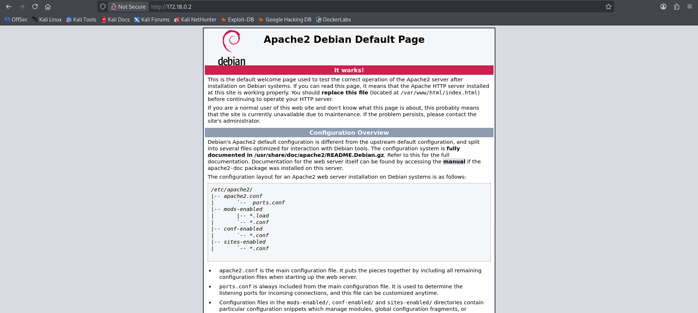
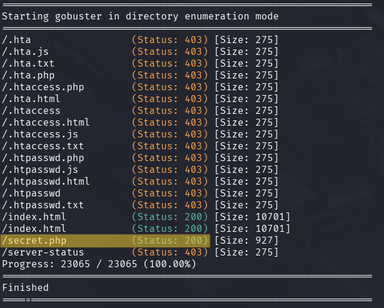
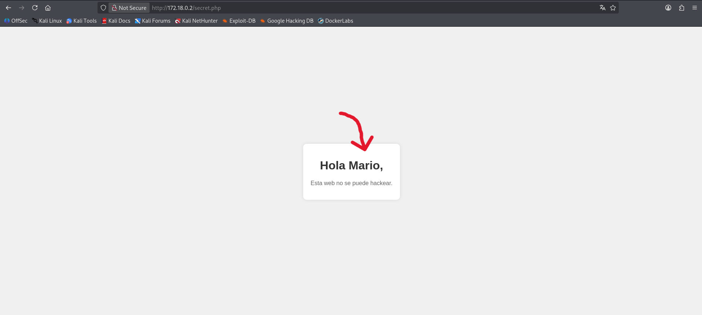
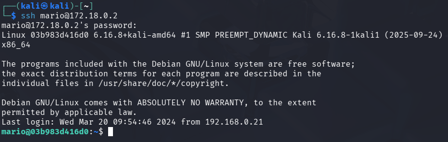
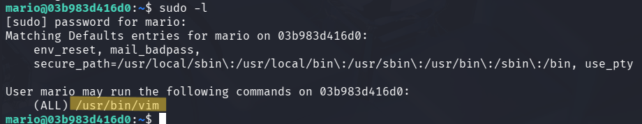
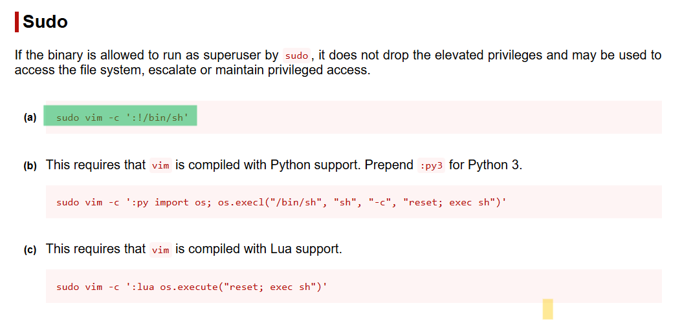
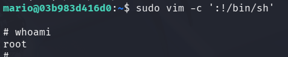

# 🧾 Writeup – Máquina: Trust

> 🔒 *Este writeup documenta el proceso educativo de explotación de la máquina “Trust”, orientado únicamente al aprendizaje en ciberseguridad y hacking ético.*

---

## 1. Información General

- **Nombre:** Trust  
- **Dificultad:** Muy Fácil  
- **Dirección IP:** `172.18.0.2`  
- **Objetivo:** Enumerar servicios, identificar vulnerabilidad en la aplicación web/servidor expuesto y obtener acceso al sistema.

La máquina se enfoca en enumeración web, extracción de información sensible, fuerza bruta de SSH y escalada de privilegios mediante un binario sudo vulnerado (vim)

---

## 2. Reconocimiento Inicial

Se realiza un escaneo de servicios con nmap utilizando scripts básicos (-sC) y detección de versiones (-sV)

```bash
nmap -sC -sV -oN escaneo_inicial.txt 172.18.0.2
```


> - El puerto 22 (SSH) está abierto, pero sin credenciales aún no es explotable.
> - El puerto 80 muestra un servidor Apache en Debian, que normalmente carga una página por defecto cuando no hay una aplicación desplegada.

De aquí se infiere que la vía de explotación probablemente esté en el servidor web, mediante:
- Fuzzing de directorios
- Archivos expuestos
- Alguna aplicación vulnerable detrás del Apache
- Posible enumeración de usuarios o credenciales débiles

---

## 3. Exploración del Servicio Web (Puerto 80)

Accedí directamente a la dirección "http://172.18.0.2" para revisar si existía alguna aplicación web o contenido útil para explotación.



Esta página indica que:
- El servidor web está funcionando correctamente.  
- No existe una aplicación web cargada; solo se muestra el archivo por defecto `/var/www/html/index.html`.  
- No se encuentran enlaces, formularios ni rutas adicionales.  

### 🔎 Observaciones

Cuando aparece la **Apache2 Debian Default Page** en un entorno de laboratorio, normalmente significa que:

- Puede haber contenido oculto accesible a través de enumeración (fuzzing).  
- El administrador pudo haber dejado archivos olvidados o directorios sin protección.  
- No hay información útil a simple vista, por lo que el siguiente paso recomendado es usar herramientas como **Gobuster**, **Dirb**, **Feroxbuster**, etc., para buscar rutas ocultas.

---

## 4. Enumeración de Directorios con `Gobuster`

Dado que la página web no mostraba contenido útil, se procedió a realizar una enumeración de rutas ocultas utilizando **Gobuster**:

```bash
gobuster dir -u http://172.18.0.2 -w /usr/share/wordlists/dirb/common.txt -x php,html,js,txt
```



Resultados principales encontrados:

La mayoría de los resultados arrojaron códigos 403 (Forbidden) o correspondían a archivos comunes del servidor. Sin embargo, se identificó un archivo especialmente relevante:

### 🔎 Ruta descubierta: /secret.php (Status: 200)

Esta ruta retorna un código 200, indicando que el archivo es accesible y posiblemente contiene información o funcionalidades sensibles.
> El siguiente paso consiste en acceder a "http://172.18.0.2/secret.php" para analizar su contenido.

---

## 5. Análisis del archivo `secret.php`

Al acceder a la ruta descubierta anteriormente "http://172.18.0.2/secret.php", se muestra el siguiente contenido:



La página despliega un mensaje:

> **Hola Mario,  
> Esta web no se puede hackear.**

### 🔎 Observaciones

El elemento más llamativo es el nombre **“Mario”**, mostrado de forma explícita en la página.  
Esto sugiere fuertemente que:

- **Existe un usuario del sistema llamado “mario”.**  
- El archivo `secret.php` podría haber sido creado como un mensaje personalizado o como pista deliberada.
- Esta información es potencialmente útil para intentar fuerza bruta, SSH o cualquier tipo de autenticación relacionada al usuario.

Dado que el servicio SSH (`OpenSSH 9.2p1`) está disponible en el puerto 22, obtener un nombre de usuario real es un paso clave para un eventual acceso.

### ✔️ Conclusión de este punto

La enumeración del archivo `secret.php` nos proporciona la **primera pieza de información explotable**:  
**el nombre de usuario “mario”**, probablemente válido para SSH u otros mecanismos de autenticación dentro del sistema.

---

## 6. Ataque de Fuerza Bruta con Hydra (SSH)

Tras identificar que existe un posible usuario llamado **mario** y sabiendo que el puerto **22/SSH** está abierto, se procedió a realizar un ataque de fuerza bruta con **hydra** para obtener su contraseña.

```bash
hydra -l mario -P /usr/share/wordlists/metasploit/unix_passwords.txt ssh://172.18.0.2
```


Hydra logró encontrar credenciales válidas:

- Usuario: `mario`
- Contraseña: `chocolate`

### 🔎 Observaciones

- El acceso SSH ahora es posible usando estas credenciales.
- Este hallazgo permite avanzar hacia el acceso al sistema y potencial escalada de privilegios.

---

## 7. Acceso al Sistema y Escalada de Privilegios

Una vez obtenidas las credenciales válidas (`mario : chocolate`), se procedió a conectarse al servidor mediante SSH:

```bash
ssh mario@172.18.0.2
```



El acceso fue exitoso, obteniendo una sesión interactiva como el usuario mario.

---

### 7.1 Enumeración de privilegios con `sudo -l`

El siguiente paso fue identificar si el usuario disponía de permisos especiales mediante sudo:

```bash
sudo -l
```



El resultado indica que mario puede ejecutar /usr/bin/vim como root sin contraseña:

```bash
(ALL) /usr/bin/vim
```

Esto es extremadamente relevante porque vim es una herramienta que permite ejecutar comandos del sistema, y cuando se ejecuta bajo sudo, estos comandos se realizan con privilegios de root.

---

### 7.2 Búsqueda de técnica de escalada en GTFOBins

Consultando la base GTFOBins (https://gtfobins.github.io/gtfobins/vim/), se confirma que vim puede usarse para obtener una shell privilegiada cuando es ejecutado como sudo. `sudo vim -c ':!/bin/sh'`



---

### 7.3 Ejecución del exploit y obtención de root

Se ejecutó el comando indicado:

```bash
sudo vim -c ':!/bin/sh'
```



Y se obtuvo exitosamente una shell como usuario **root**

---

## Conclusión

El usuario mario tenía permisos sudo inseguros sobre vim, lo que permitió ejecutar comandos arbitrarios como root y escalar privilegios de forma inmediata.

**¡La máquina queda completamente comprometida!**